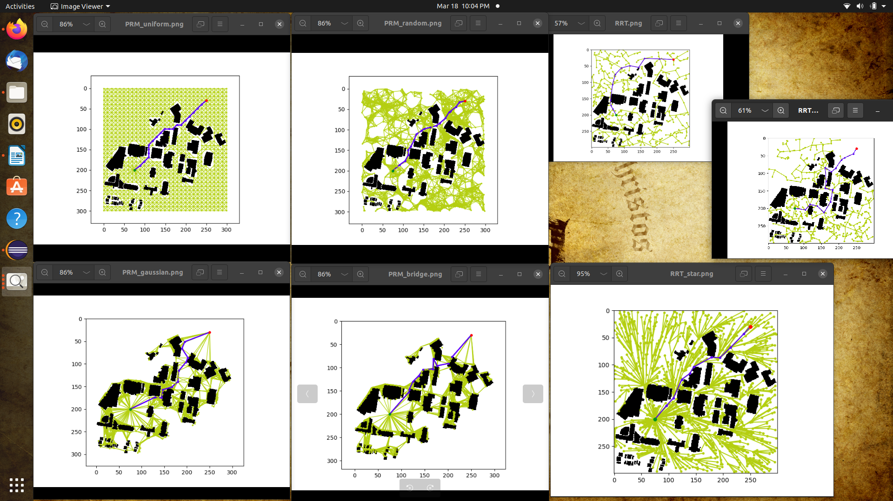
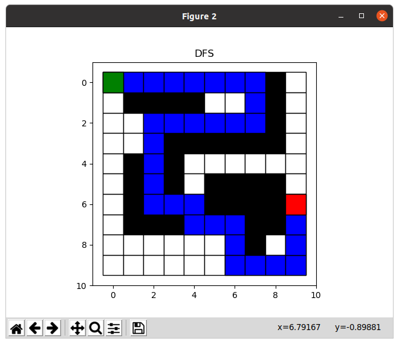
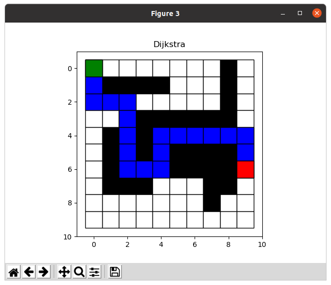
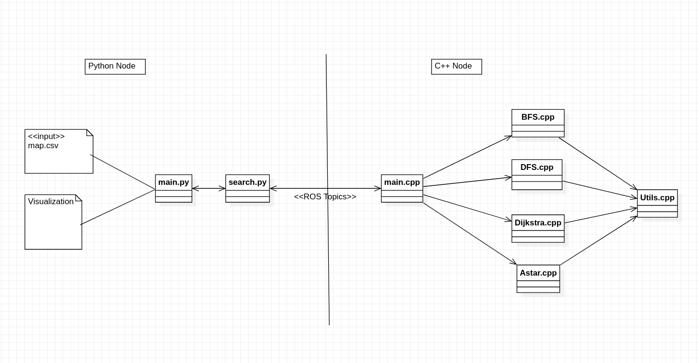

# Classic Path Planning algorithms for WPI Campus Map

## Sampling Based Algorithms
The following sampling based algorithms are implemented in Python:
1. RRT
2. RRT*
3. PRM - Uniform Sampling
4. PRM - Random Sampling
5. PRM - Gaussian Sampling
6. PRM - Bridge Sampling

### Results
<figure>
    
</figure>


## Grid Based Algorithms
At the moment, the following graph search algorithms are implemented in C++:
1. Breadth First Search (BFS)
2. Dept First Search (DFS)
3. Dijkstra
4. A*

> :information_source: The algorithms are implemented in C++ and the visualization is done using Python scripts.

---
### Output paths in the graph 
<p float="left">
  
  
</p>

<p float="left">
  
  
</p>

~~~
Here's the number of cells each algorithm visits before hitting the goal:
  
  * It takes 64 steps to find a path using BFS
  * It takes 33 steps to find a path using DFS
  * It takes 64 steps to find a path using Dijkstra
  * It takes 60 steps to find a path using A*
~~~

---
## High Level View

<p float="left">
  
</p>


---
## Building

To build from source, clone the latest version from this repository into your catkin workspace and compile the package using

	```bash
	$ cd catkin_workspace/src
	$ git clone https://github.com/emmanuel-logy/motion_planning_algorithms.git
	$ cd ..
	$ catkin_make
	```
    
---
## For further explanation

Please refer to the docs/Emmanuel_Report.pdf for more detailed explanation
	
	
---
    
